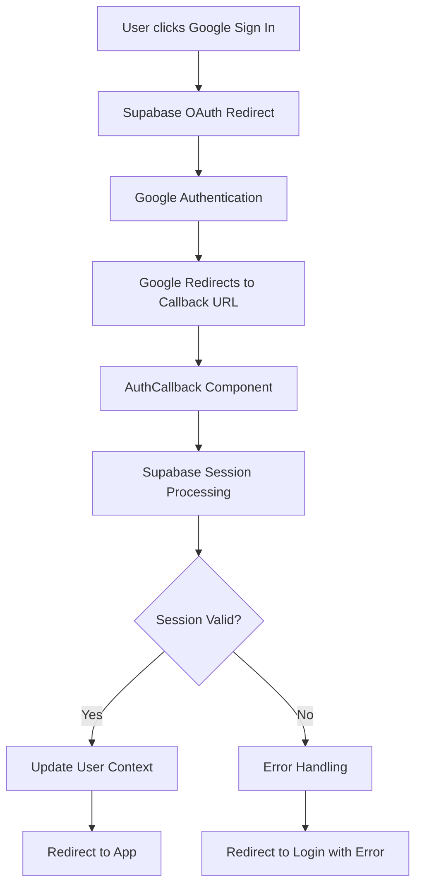
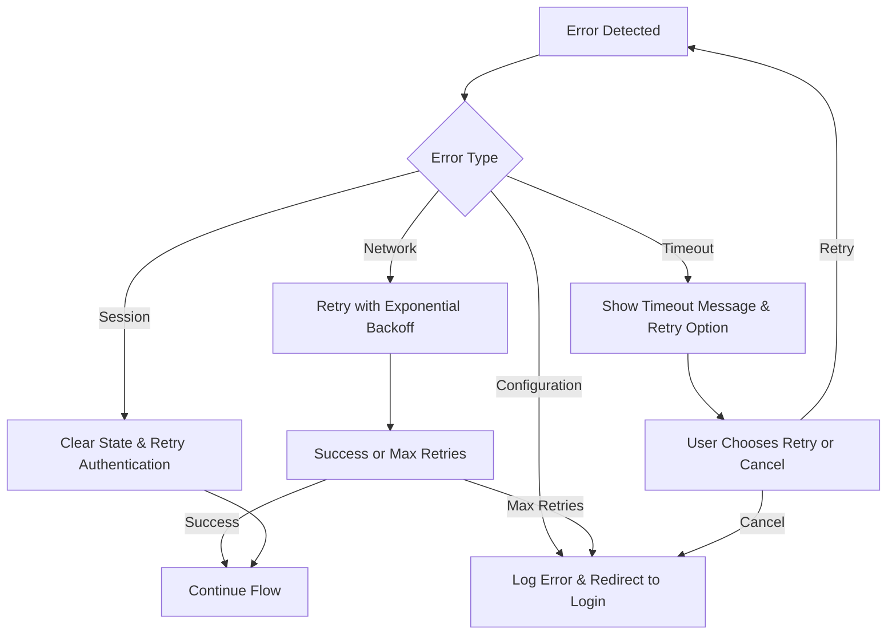

# Design Document

## Overview

The Google OAuth authentication system in Emmy's Learning App requires comprehensive fixes to address redirect URL mismatches, callback processing issues, and authentication flow inconsistencies. The current implementation has hardcoded production URLs, improper callback handling, and lacks proper error recovery mechanisms.

## Architecture

### Current Issues Identified

1. **Redirect URL Mismatch**: The OAuth redirect URL is hardcoded to production (`https://mlaniak.github.io/emmys-learning-app/auth/callback`) but the app doesn't have a proper route for `/auth/callback`
2. **Missing Route Configuration**: No route exists for the auth callback in the router configuration
3. **Manual URL Processing**: The AuthCallback component manually processes URL fragments instead of using Supabase's built-in session handling
4. **Environment-Specific Configuration**: No dynamic configuration for development vs production environments
5. **Error Handling**: Limited error recovery and user feedback mechanisms

### Proposed Solution Architecture



## Components and Interfaces

### 1. Environment Configuration

**Purpose**: Dynamically configure OAuth settings based on environment

**Interface**:
```javascript
const getOAuthConfig = () => ({
  redirectTo: isDevelopment() 
    ? 'http://localhost:5173/auth/callback'
    : 'https://mlaniak.github.io/emmys-learning-app/auth/callback',
  queryParams: {
    access_type: 'offline',
    prompt: 'consent',
  }
})
```

### 2. Router Configuration Update

**Purpose**: Add proper routing for OAuth callback

**Changes**:
- Add `/auth/callback` route to main router
- Ensure AuthCallback component is properly mounted
- Handle both hash-based and path-based routing

### 3. Enhanced AuthCallback Component

**Purpose**: Robust OAuth callback processing with proper error handling

**Key Features**:
- Use Supabase's built-in session detection instead of manual URL parsing
- Implement timeout handling for slow authentication
- Provide clear user feedback during processing
- Graceful error recovery with specific error messages

### 4. UserContext OAuth Integration

**Purpose**: Seamless integration with existing user management

**Enhancements**:
- Environment-aware OAuth configuration
- Improved session state management
- Better error propagation to UI components

## Data Models

### OAuth State Management

```javascript
const oauthState = {
  isProcessing: boolean,
  error: string | null,
  redirectUrl: string,
  timeoutId: number | null
}
```

### User Session Enhancement

```javascript
const userSession = {
  ...existingUserData,
  authProvider: 'google' | 'email' | 'guest',
  lastAuthTime: timestamp,
  authError: string | null
}
```

## Error Handling

### Error Categories

1. **Network Errors**: Connection issues during OAuth flow
2. **Configuration Errors**: Invalid redirect URLs or OAuth settings
3. **Session Errors**: Failed session establishment
4. **Timeout Errors**: Authentication process taking too long

### Error Recovery Strategy



### User-Friendly Error Messages

- **Network Issues**: "Connection problem. Please check your internet and try again."
- **Configuration Issues**: "Authentication setup error. Please contact support."
- **Session Issues**: "Sign-in incomplete. Please try signing in again."
- **Timeout Issues**: "Sign-in is taking longer than expected. Would you like to try again?"

## Testing Strategy

### Unit Tests
- OAuth configuration generation for different environments
- Error handling logic in AuthCallback component
- UserContext OAuth method functionality

### Integration Tests
- Complete OAuth flow from button click to user session
- Error scenarios and recovery mechanisms
- Cross-browser compatibility

### Manual Testing Scenarios

1. **Happy Path**: Successful Google OAuth in both development and production
2. **Network Interruption**: Test behavior when network fails during OAuth
3. **Invalid Configuration**: Test with incorrect redirect URLs
4. **Session Timeout**: Test long authentication delays
5. **User Cancellation**: Test when user cancels Google authentication
6. **Multiple Attempts**: Test repeated authentication attempts

### Environment Testing

- **Development**: Local server with `http://localhost:5173`
- **Production**: GitHub Pages with `https://mlaniak.github.io/emmys-learning-app`
- **Mobile Browsers**: iOS Safari, Android Chrome
- **Desktop Browsers**: Chrome, Firefox, Safari, Edge

## Implementation Phases

### Phase 1: Core Fixes
- Fix redirect URL configuration
- Add proper routing for auth callback
- Implement environment detection

### Phase 2: Enhanced Error Handling
- Add comprehensive error handling
- Implement user feedback mechanisms
- Add retry logic for failed authentications

### Phase 3: Testing & Optimization
- Comprehensive testing across environments
- Performance optimization
- User experience improvements

## Security Considerations

- Validate redirect URL origins to prevent open redirect attacks
- Implement CSRF protection through Supabase's built-in mechanisms
- Ensure OAuth state parameters are properly handled
- Clear sensitive data from URLs after processing
- Implement proper session timeout handling